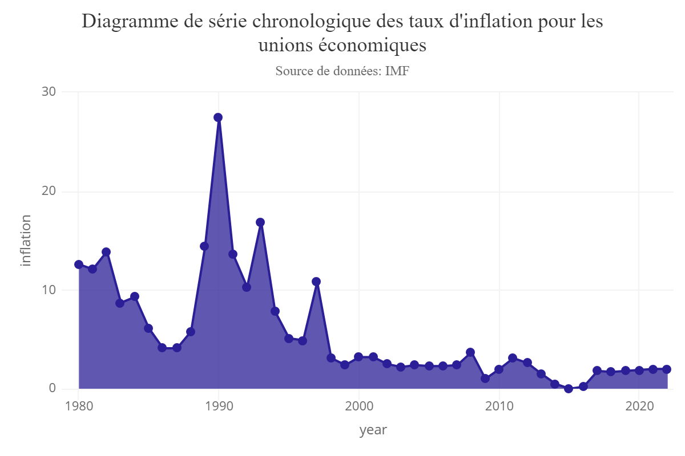

# 🌍 Dashboard Shiny – Taux d'inflation mondial (1980–2022)

> Visualisation interactive de l'évolution de l'inflation dans le monde de 1980 à 2022 à l'aide de R Shiny.

## 📌 Présentation

Ce projet propose un tableau de bord interactif développé en **R Shiny** permettant d'explorer les taux d'inflation par pays et par régions économiques sur plus de 40 ans. Le jeu de données provient de la **Banque mondiale** et couvre jusqu'à 167 pays et plusieurs zones régionales.


## 🧠 Objectifs pédagogiques

- Manipuler un jeu de données complexe et le restructurer pour l’analyse
- Utiliser R pour la visualisation avancée avec `ggplot2`, `highcharter`, `leaflet`
- Déployer une interface Shiny avec carte interactive, filtres dynamiques et graphes interactifs

## 📁 Structure du projet

```
📦 inflation-dashboard
├── ui.R           # Interface utilisateur
├── server.R       # Logique serveur (backend)
├── global.R       # Chargement des données et packages
├── style.css      # Feuille de style personnalisée
├── input_data/
│   ├── inflation.xls   # Jeu de données principal
│   └── 50m.geojson     # Données géospatiales des pays
└── img/
    ├── chart1.png
    ├── chart2.png
    ├── chart3.png
    ├── chart4.png
    └── map.png
```
## ⚙️ Fonctionnalités principales

    ✅ Visualisation de l’inflation par pays (graphiques linéaires interactifs)

    ✅ Comparaison de l’inflation entre plusieurs pays

    ✅ Visualisation chronologique pour des régions économiques (ex : Union Européenne)

    ✅ Affichage global de l’évolution de l’inflation mondiale

    ✅ Carte interactive (Leaflet) avec taux d’inflation par pays et slider temporel

## 📊 Exemple de visualisations
#### Évolution du taux d'inflation (France)

#### Comparaison entre plusieurs pays

#### Taux pour l'Union Européenne

#### Inflation mondiale

#### Carte interactive


## 📦 Technologies utilisées

R, Shiny, shinydashboard, shinyWidgets, ggplot2, highcharter, leaflet, dplyr, tidyr, readxl, geojsonio, htmlwidgets, RColorBrewer, sf, rvest

## 🧹 Pré-traitement des données

- Transformation du jeu de données inflation.xls avec gather() pour passer en format long.
- Nettoyage des noms de pays et identification des régions économiques.
- Jointure avec les données géospatiales (.geojson) pour affichage cartographique.

## 📂 Données
- Source principale : Banque Mondiale, IMF
- Fichier principal : inflation.xls (fréquence annuelle 1980–2022)
- Géospatiales : 50m.geojson (source : datahub.io)

## 📌 Auteur
Projet réalisé par MADANI Riad, 2022
Contact : LinkedIn : Riad MADANI · Email : madani.riad@outlook.fr

## 🚀 Lancer l'application

Dans RStudio :
```
shiny::runApp()
```
