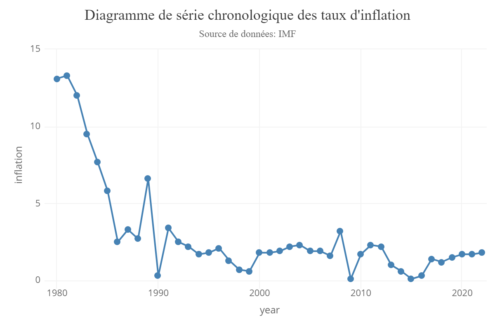
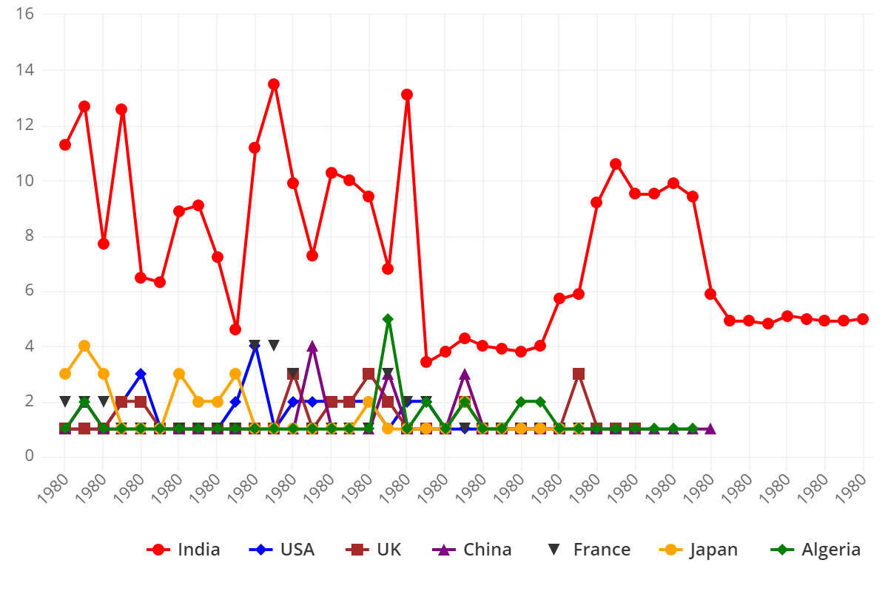
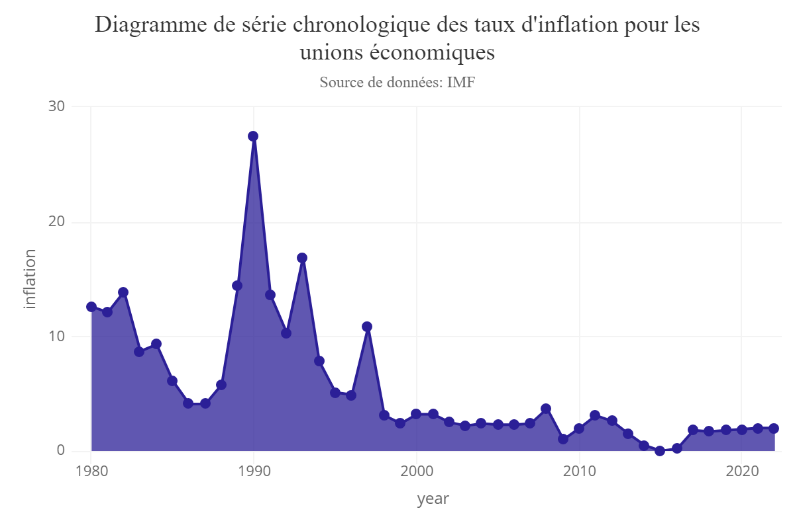
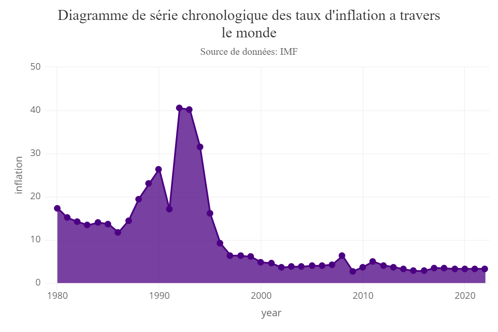
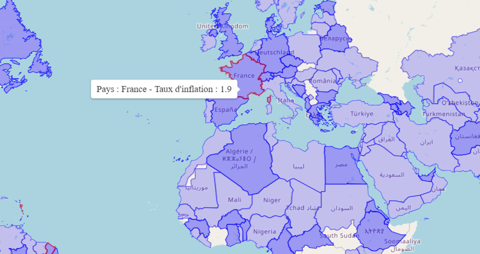

```{r Options pour les chunks , include=FALSE}
knitr::opts_chunk$set(message = FALSE, warning = FALSE)

```

# Taux d'inflation dans le monde [1980-2022]

Le Groupe des perspectives de la Banque mondiale a construit un jeu de données mondial sur l'inflation. Ce jeu de données couvre jusqu'à 167 pays et plusieurs régions économiques dans le monde sur la période de 1980 au 2022, et comprend la mesure de l'inflation en fréquences annuelle : Inflation globale de l'indice des prix à la consommation (IPC)
Nous avons utilisé ce jeu de données pour élaborer un tableau de bord qui nous permet de visualiser le taux d'inflation durant cette periode d'années

#global.R

Un fichier qui contient toutes les bibliothèques nécessaires a la bonne exécution de notre programme ainsi que l'importation des fichier à utilisés dont le jeu de données et le fichier geojson ("worldcountry" pour les données spatial)
Des pré-traitement des données pour une utilisation plus adéquate a nos graphs de visualisation
     
## Imporation des différents packages si ses derniers ne sont pas installées sur la machine 
```{r eval=FALSE}
if(!require(shiny)) install.packages("shiny", repos = "http://cran.us.r-project.org")
if(!require(shinyWidgets)) install.packages("shinyWidgets", 
                                            repos="http://cran.us.r-project.org")
if(!require(shinydashboard)) install.packages("shinydashboard",
                                              repos = "http://cran.us.r-project.org")
if(!require(shinythemes)) install.packages("shinythemes", 
                                           repos = "http://cran.us.r-project.org")
if(!require(shinycssloaders)) install.packages("shinycssloaders", 
                                               repos = "http://cran.us.r-project.org")
if(!require(magrittr)) install.packages("magrittr", 
                                        repos ="http://cran.us.r-project.org")
if(!require(rvest)) install.packages("rvest",
                                     repos = "http://cran.us.r-project.org")
if(!require(readxl)) install.packages("readxl",
                                      repos = "http://cran.us.r-project.org")
if(!require(dplyr)) install.packages("dplyr", 
                                     repos = "http://cran.us.r-project.org")
if(!require(maps)) install.packages("maps", 
                                    repos = "http://cran.us.r-project.org")
if(!require(ggplot2)) install.packages("ggplot2", 
                                       repos = "http://cran.us.r-project.org")
if(!require(reshape2)) install.packages("reshape2", 
                                        repos = "http://cran.us.r-project.org")
if(!require(ggiraph)) install.packages("ggiraph", 
                                       repos = "http://cran.us.r-project.org")
if(!require(RColorBrewer)) install.packages("RColorBrewer", 
                                            repos="http://cran.us.r-project.org")
if(!require(leaflet)) install.packages("leaflet", 
                                       repos = "http://cran.us.r-project.org")
if(!require(plotly)) install.packages("plotly", 
                                      repos = "http://cran.us.r-project.org")
if(!require(geojsonio)) install.packages("geojsonio", 
                                         repos = "http://cran.us.r-project.org")
library(highcharter)
library(tidyr)
library(knitr)
library(tinytex)
library(sf)
library(kableExtra)

```


### Lecture de notre jeu de données
Utilisation du package readxl pour lire le contenu du fichier de notre jeu de données <<inflation.xls>> et renvoier la première partie du jeu de données.
```{r inflation}
library(readxl)
library(kableExtra)
#Utilisation du package readxl pour lire le contenu du fichier excel de notre dataset
inflation <- read_excel("input_data/inflation.xls")
#Renvoier la première partie (5 lignes) du jeu de données.
head(inflation)
```

### Utilisation d'un fichier geojson (du package "geojsonio") 
Pour récupérer les coordonnées spatial de chaque pays pour qu'on puisse les affichées sur la map
```{r WorldCountry}
library(geojsonio)
worldcountry = geojson_read("input_data/50m.geojson", what = "sp")
```

### Pré-traitement de nos données :
Pour une utilisation facile & simple ultérieurement de nos données, nous avons mis les années dans une liste en tant que chaine de caractère ainsi que de reformater notre jeu de données dans un nouveau dataframe appelé "inf" 

```{r inf, echo=TRUE}
library(dplyr)
library(tidyr)
library(kableExtra)
#Créer un vecteur contient les années dans notre jeu de données
year<-c(1980:2022) 
year<-as.character(year)
#Reformater notre jeu de données d'une façon que nous affichons les taux d'inflation 
#par rapport a chaque pays et a chaque années (nous avons rassembler les années 
#dans une seule colonne <Year>)
inf <- inflation %>% gather(year,key = "Year",value="InflationRate") 
names(inf)<-c("region","year","inflation")
inf$year<-as.integer(inf$year)
head(inf) %>%
      kable() %>%
      kable_styling(latex_options = "hold_position")
```

### Pré-traitement des noms des pays et des régions économiques 
Nous avons créer un nouveau variable nommé "country" qui contient une liste des noms de pays "region" a partir de notre nouveau dataset "inf"
Ensuite nous avons créer aussi une liste qui contient les régions économiques a travers le monde. (c'est un peu manuelle mais c'est efficace)
```{r}
country <- c(inf$region)
unions<-c("Major advanced economies (G7)","European Union",
          "Emerging and Developing Europe","ASEAN-5",
          "Commonwealth of Independent States",
          "Emerging and Developing Asia","Latin America and the Caribbean",
          "Middle East, North Africa, Afghanistan, and Pakistan")
```

### Données sapatial des pays a travers le monde
Nous avons utilisé le fichier "50m.geojson" (téléchargé depuis <src : https://datahub.io/core/geo-countries>)  pour récuperer les données spatial de chaque pays afin de les utilisés dans l'affichage de la carte 
Voici la premiere partie (les 5 premieres ligne de notre data frame plot_map) qui contient les noms des pays contenant dans notre nouveau jeu de données "inf"
```{r}
plot_map <- worldcountry[worldcountry$ADMIN %in% inf$region, ]

```
### Comparaison entre quelques taux d'inflations de quelques différentes nations
Nous avons préparer quelques données des 5 pays (Inde, Chine, Japon, USA, Rayaum Uni, France, Algérie) pour faire une comparaison entre ses nations en ce qui concerne le taux d'inflation, vous pouvez remarquer le résultat du dataframe de la nation FRANCE ci-dessous
```{r}
India<-filter(inf,region=="India")
India$inflation<-as.numeric(India$inflation)
India$year<-as.numeric(India$year)
China<-filter(inf,region=="China, People's Republic of")
Japan<-filter(inf,region=="Japan")
US<-filter(inf,region=="United States")
UK<-filter(inf,region=="United Kingdom")
Fr<-filter(inf,region=="France")
ALG<-filter(inf,region=="Algeria")
tail(Fr) %>% kable() %>%
      kable_styling(latex_options = "hold_position")
```
# ui.R
Un fichier de notre projet qui contient la partie frontend ou ce qu'on appelle l'interface graphique 


# server.R
Un fichier qui contient la partie backend de notre application avec des fonction reactives et des graphique ainsi qu'une map carthographique pour une visualisation plus dynamique

```{r}
server <- function(input, output) {

  #Création d'une fonction réactive data_input() qui réagit en fonction de 
  #l'année sélectionner dans le slider pour l'affichage des taux d'inflation
  
  data_input <- reactive({
    inf %>%
      filter(year == input$slider1)
  })

  #Création d'une 2eme fonction réactive data_input_ordered qui permet de 
  #vérifier la correspondance des noms de pays entre la fonction data_input() 
  #et les coordonnées spatial de plot_map
  data_input_ordered <-  reactive({
    data_input()[order(match(data_input()$region, plot_map$ADMIN)),]

  })
  ...
  
}
```


## Dessiner les graphes de notre Shiny Dashboard App
### Exemple : France
Nous avons utiliser la bibliothèque "Dplyr" pour faire du Pipe '%>%' et de filtrer les pays pour avoir le résultat affiché dans un graph correspondant au pays choisi, ici on a pris, l'exemple de la france mais dans l'application une liste de tout les pays du dataset est dispo pour visualiser chaque taux d'infalation
Pour le graph, nous avons utilisé le package (ggplot2) avec un theme pour une meilleure qualité de visualisation, ce que vous allez le voir juste en dessous du code suivant 


```{r plot1}
library(ggplot2)
library(highcharter)
theme_set(theme_bw(base_size = 16))
df<-inf %>% filter(region=="France")
df$inflation<-as.numeric(df$inflation)
df$year<-as.numeric(df$year)
#plotting the data
hchart(df, "line",color="#4682B4",hcaes(x=year,y=inflation))  %>%
  hc_exporting(enabled = TRUE) %>%
  hc_tooltip(crosshairs = TRUE, backgroundColor = "#FCFFC5", 
             shared = FALSE, borderWidth = 2) %>%
  hc_title(text="Diagramme de série chronologique des taux d'inflation",
           align="center") %>%
  hc_subtitle(text="Source de données: IMF",align="center") %>%
  hc_add_theme(hc_theme_elementary())
```

```{r pressure1, echo=FALSE, fig.cap="Taux d'inflation en France", out.width = '70%', fig.align="center"}


```

\newpage
## Comparaison de quelques taux d'inflation qui correspond a quelques pays (Choix personnel)
Avec l'utilisation du thème hc_add_series du package 'ggplot2' pour une meilleure visualisation des données  
```{r}
library(ggplot2)
library(highcharter)
theme_set(theme_bw(base_size = 16))
highchart() %>%
      hc_xAxis(categories=inf$year) %>%
      hc_exporting(enabled = TRUE) %>% 
      hc_add_series(name = "India", data = India$inflation) %>%
      hc_add_series(name = "USA", data = US$inflation) %>%
      hc_add_series(name = "UK", data = UK$inflation) %>%
      hc_add_series(name = "China", data = China$inflation) %>%
      hc_add_series(name = "France", data = Fr$inflation) %>%
      hc_add_series(name="Japan",data=Japan$inflation) %>%
      hc_add_series(name="Algeria",data=ALG$inflation) %>%
      #Pour ajouter les couleurs
      hc_colors(c("red","blue","brown","purple","darkpink","orange","green")) %>%
      hc_add_theme(hc_theme_elementary())

```

```{r pressure2, echo=FALSE, fig.cap="Comparaison des taux d'inflation", out.width = '70%', fig.align="center"}


```
\newpage

## Diagramme chronologique des taux d'inflation dans les plus grandes régions économiques du monde
### Exemple : Union Europeen

Pour afficher l'évolution du taux d'inflation en fonction des régions économiques dans le monde au cours des années (Nous avons pris l'exemple de l'union europeen)

```{r}
library(ggplot2)
library(highcharter)
theme_set(theme_bw(base_size = 16))
union<-inf %>% filter(region=="European Union")
union$year<-as.numeric(union$year)
union$inflation<-as.numeric(union$inflation)
#traçage des graphs
hchart(union,hcaes(x=year,y=inflation),
       type="area",color="#2B1F97") %>%
  hc_exporting(enabled = TRUE) %>%
  hc_tooltip(crosshairs = TRUE, backgroundColor = "#FCFFC5",
             shared = TRUE, borderWidth = 2) %>%
  hc_title(text="Diagramme chronologique des taux d'inflation des régions
           économiques dans le monde",align="center") %>%
  hc_subtitle(text="Source de données: IMF",align="center") %>%
  hc_add_theme(hc_theme_elementary())

```

```{r pressure3, echo=FALSE, fig.cap="Taux d'inflation de l'union europeen", out.width = '70%', fig.align="center"}


```
\newpage

## Diagramme de série chronologique des taux d'inflation a travers le monde

Un graph qui permet d'afficher l'évolution du taux d'inflation dans le monde entier au fil des années

```{r}
library(ggplot2)
library(highcharter)
theme_set(theme_bw(base_size = 16))
world<-inf %>% filter(region=="World")
world$year<-as.numeric(world$year)
world$inflation<-as.numeric(world$inflation)

#traçage des graphs
hchart(world,hcaes(x=year,y=inflation),type="area",color="#4B0082") %>%
  hc_exporting(enabled = TRUE) %>%
  hc_tooltip(crosshairs = TRUE, backgroundColor = "#FCFFC5", shared = TRUE, borderWidth = 2) %>%
  hc_title(text="Diagramme chronologique des taux d'inflation a travers le
           monde",align="center") %>%
  hc_subtitle(text="Source de données: IMF",align="center")  %>%
  hc_add_theme(hc_theme_elementary())
```
```{r pressure4, echo=FALSE, fig.cap="Taux d'inflation du monde", out.width = '70%', fig.align="center"}


```
\newpage

## Un graph cartographique qui permet de visualiser a l'aide du slider (pour la sélection des années) le taux d'inflation de chaque pays

```{r}
library(leaflet)
mymap <- leaflet() %>%
        addTiles() %>%
        addPolygons(data = plot_map, color = "blue",
                    label = ~paste0("Pays : ", ADMIN," - Taux d'inflation : ",
                                    as.numeric(inf$inflation)),
                    weight = 1,
                    highlightOptions = highlightOptions(color = "red", 
                                                        bringToFront = TRUE, 
                                                        weight = 2),
                    labelOptions = labelOptions(
                      style = list("font-weight" = "normal", padding = "3px 8px"),
                      textsize = "15px",
                      direction = "auto")
                    )
```

```{r worldmap, echo=FALSE, fig.cap="Carte carthographique", out.width = '70%', fig.align="center"}


```


